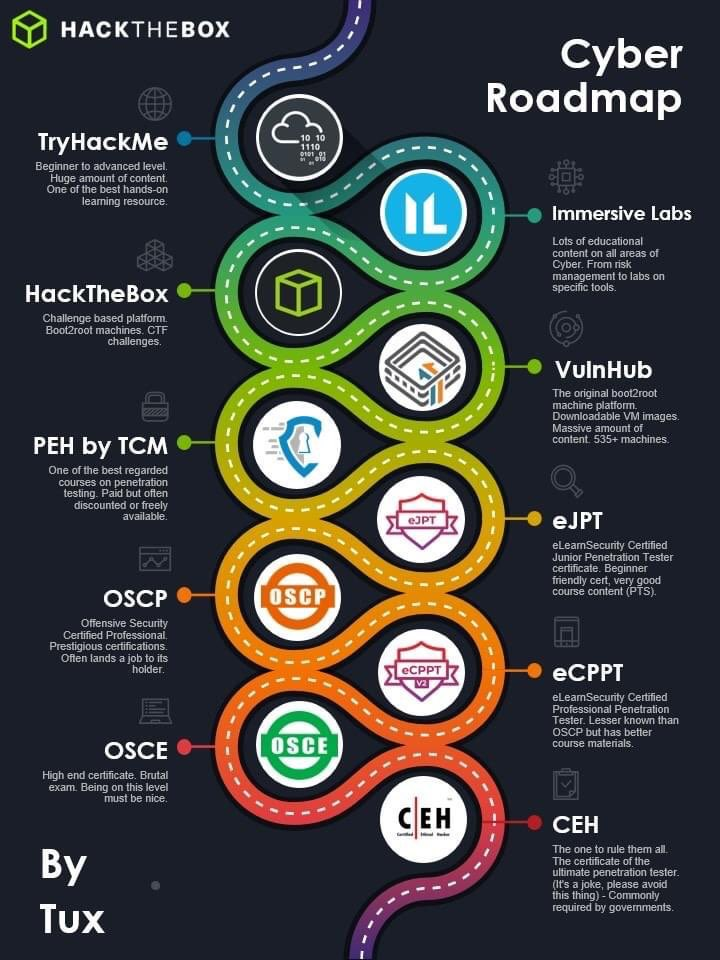

# liens utiles cybersec

### **WSA :**

{% embed url="https://sites.google.com/view/secu-hacking/labs-web-security-academy-th%C3%A8mes?authuser=0" %}

### Orientations :

Merci à @0xTimD pour la roadmap pentest de HackTheBox ! Elle présente un peut pour avoir une idée non par quoi commencer et par quoi continuer. 

@!comores11 : C'est vraiment une roadmap pour le "Pentest",  juste le CEH à la fin c'est à discuter.

Voici une des meilleures plateformes d'apprentissage dans le domaine du hacking \( sans doute la meilleure parmi celles gratuites \) concernant les vulnérabilités liées au monde du web :

[https://portswigger.net/web-security](https://portswigger.net/web-security)

* Elle est en anglais \(oui, dans le monde du hacking, l'anglais est indispensable \)
* Créée par les fondateurs du célèbre logiciel Burp Suite
* Correspond à tous types de personnes, qu'elle soit débutante ou expérimentée
* Très souvent mise à jour \( nouvelles catégories de challenges, articles d'experts en sécurité,...\)
* Plus de 185 challenges de tous les niveaux sur le domaine du web avec les corrections disponibles
  * Des cours et challenges dans chacun des domaines suivants :
  * SQL injection
  * Cross-site scripting \( XSS\)
  * Cross-site request forgery \(CSRF\)
  * Clickjacking
  * DOM-based vulnerabilities
  * Cross-origin resource sharing \(CORS\)
  * XML external entity \(XXE\) injection
  * Server-side request forgery \(SSRF\)
  * HTTP request smuggling
  * OS command injection
  * Server-side template injection
  * Access control vulnerabilities
  * Authentication
  * WebSockets
  * Web cache poisoning
  * Insecure deserialization
  * Information disclosure
  * Business logic vulnerabilities

Voici un site regroupant des milliers de programmes \("crackme"\) pour s'entraîner au Reverse Engineering. Il est accessible pour les niveaux : [https://crackmes.one/](https://crackmes.one/) Voici une excellente série de vidéos abordant le domaine de la cryptographie pour les débutants : [https://www.youtube.com/watch?v=V9bTy0gbXIQ&list=PLOapGKeH\_KhFBC39ltMDhkEx1aI3hlwSK](https://www.youtube.com/watch?v=V9bTy0gbXIQ&list=PLOapGKeH_KhFBC39ltMDhkEx1aI3hlwSK)

[https://cryptohack.org/](https://cryptohack.org/) pour apprendre la crypto avec des bons challs \(scripting requis au bout d'un certain moment\) [https://gtfobins.github.io/](https://gtfobins.github.io/) pour privesc via une grande partie des binaires linux

Plusieurs chaines / sites lié principalement \(mais pas que\) au bug bounty \(tout est en anglais\)

* Guide to learn hacking [https://www.youtube.com/watch?v=2TofunAI6fU](https://www.youtube.com/watch?v=2TofunAI6fU)
* Finding your first bug: bounty hunting tips from the Burp Suite community [https://portswigger.net/blog/finding-your-first-bug-bounty-hunting-tips-from-the-burp-suite-community](https://portswigger.net/blog/finding-your-first-bug-bounty-hunting-tips-from-the-burp-suite-community)
* Practice [https://portswigger.net/web-security](https://portswigger.net/web-security)
* Nahamsec's Twitch [https://www.twitch.tv/nahamsec](https://www.twitch.tv/nahamsec)
* Nahamsec interviews with top bug bounty hunters [https://www.youtube.com/c/Nahamsec](https://www.youtube.com/c/Nahamsec)
* Nahamsec's beginner repo [https://github.com/nahamsec/Resources-for-Beginner-Bug-Bounty-Hunters](https://github.com/nahamsec/Resources-for-Beginner-Bug-Bounty-Hunters)
* Stök [https://www.youtube.com/c/STOKfredrik](https://www.youtube.com/c/STOKfredrik)
* InsiderPhD [https://www.youtube.com/c/InsiderPhD](https://www.youtube.com/c/InsiderPhD)
* Series for new bug hunters [https://www.youtube.com/playlist?list=PLbyncTkpno5FAC0DJYuJrEqHSMdudEffw](https://www.youtube.com/playlist?list=PLbyncTkpno5FAC0DJYuJrEqHSMdudEffw)
* Jhaddix [https://www.youtube.com/c/jhaddix](https://www.youtube.com/c/jhaddix)
* Posts from Hacker101 members on how to get started hacking
* zonduu [https://medium.com/@zonduu/bug-bounty-beginners-guide-683e9d567b9f](https://medium.com/@zonduu/bug-bounty-beginners-guide-683e9d567b9f)
* p4nda [https://enfinlay.github.io/bugbounty/2020/08/15/so-you-wanna-hack.html](https://enfinlay.github.io/bugbounty/2020/08/15/so-you-wanna-hack.html)
* also a blog on subdomain takeovers [https://enfinlay.github.io/sto/ip/domain/bugbounty/2020/09/12/ip-server-domain.html](https://enfinlay.github.io/sto/ip/domain/bugbounty/2020/09/12/ip-server-domain.html)
* clos2100 on getting started without a technical background [https://twitter.com/pirateducky/status/1300566000665014275](https://twitter.com/pirateducky/status/1300566000665014275)
* al-madjus tips to find your first bug [https://almadj.us/infosec/how-to-find-your-first-bug](https://almadj.us/infosec/how-to-find-your-first-bug)
* hacker101 videos [https://www.hacker101.com/videos](https://www.hacker101.com/videos)

[https://www.youtube.com/watch?v=PaB17Cc0dUg](https://www.youtube.com/watch?v=PaB17Cc0dUg) \(Certes c'est la base mais ça peut toujours servir\).

Comprendre et utilisé les SSHA sous LDPA Type de fichier joint :



Je viens de recevoir mon exemplaire gratuit durant la promotion, du pdf : Mastering Linux Security and Hardening - Second Edition je le partage pour la communauté :



